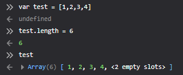

### CHAPTER 7 배열
---
#### 자바스크립트 배열의 특징
```
자바스크립트 배열은 자바스크립트 객체의 특별한 형태이고,
배열의 인덱스는 프로퍼티 이름인데, 하필 정수인 것이라고 보면 된다.
```
- **원소(element) : 배열 안의 각 값**
- **같은 배열에 있는 원소 값의 타입이 서로 다를 수 있다.**
- 최대 4294967295(2의 32승 -2) 개의 원소 (인덱스 4294967294까지)
- **동적 : 크기가 달라질 수 있고, 크기가 변경되도 배열 크기를 선언할 필요 X**
- 밀집도(sparse)↓ : 인덱스가 연속적이지 않아도 O, 원소들 사이에 빈자리 O
  → 희소배열(대부분의 원소가 0이거나 null인 배열)의 경우 실제 원소의 크기보다 크다.)
- **Array.prototpye의 프로퍼티들을 상속 받음**

#### 1. 배열 만들기
**`[] 안에 배열의 원소를 쉼표(,)로 구분`**
```js
var test = [1,3,true,"a", {x:1, y:2}, 10];
var a = new Array();
var b = new Array(10); // 미리 공간 할당
var c = new Array(3,2,1,"test,test");
```
**`배열 리터럴에서 빠진 부분  → undefined`**
```js
var undefs = [,,]; // 원소 값은 모두 undefined
//마지막 원소 다음에 쉼표를 추가할 수 있으므로 undefs의 원소는 세개가 아니라 두개
```

#### 2. 배열의 원소 읽고 쓰기
- `[]연산자` (객체 프로퍼티 접근 때 쓰는 []와 똑같이 동작)
- 배열이 일반 객체와 다른 점은 속성이름으로 2의32승보다 작은 양수를 사용할 때, 자동으로 length 프로퍼티의 값을 바꾼다는 것
- 객체에 존재하지 않는 프로퍼티 이름을 질의하면, 에러가 발생하지 않고 단순히 undefined 값이 반환
```js
var a = [ture, flase];
a[-1] // undefined
```


#### 3. 희소배열
`배열에 속한 원소의 위치가 비연속적인 배열`
* length 프로퍼티의 값은 원소의 개수보다 항상 크다
```js
a[1000] = 0 // length = 1001
```
```
- 보통배열보다 느리다
- 메모리 많이 사용
- 원소 찾는데 시간 오래 걸림
```

#### 4. 배열의 길이
**length : 자바스크립트에서 객체와 배열을 구분하는 중요한 특징**
배열에서 가장 큰 인덱스 값보다 하나 더 큰 값

```
  만약, 음이 아니며 기존 length 값보다 작은 정수 n을 length 값으로 할당할 경우,
 n번째 인덱스 보다 크거나 같은 위치에 있는 원소는 삭제된다.
```



`
ECMA5에서는 Object.defineProperty()메소드를 사용해 length 프로퍼티를 읽기 전용으로 만들 수 있다.
`
```js
a = [1,2,3];
Object.defineProperty(a, "length", {writable : false});
```


**어떤 원소를 설정 불가능 하게 만든다면, 그 원소는 지울 수 없다.
따라서, 배열의 length 프로퍼티 값 역시 해당 원소의 인덱스보다 작은 값으로 설정할 수 없다.**


#### 5. 배열에 원소 추가/삭제

- 인덱스에 값 할당
  ```js
  a = [];
  a[2] = "two";
  ```
- push() : 배열의 끝에 원소 추가
  ```js
  a = [];
  a.push("zero"); // a= ['zero'];
  a.push("one", "two") // a = ['zero', 'one', 'two'];
  ```
- unshift() :배열의 앞쪽에 원소 추가
- delete 연산자로 원소 삭제 가능 (해당원소에 undefined 값 할당과 같음)
  ```js
  a = [1, 2, 3];
  delete a[0]; 
  0 in a // false 
  delete a[0];
  0 in a // false
  ```
  

#### 6. 배열 순회
**`for loop`**
**`for/in loop`**
**`forEach()` : 배열의 원소가 인덱스 순서대로 하나씩 넘어오면서 순회한다.**  
```js
var data = [1,2,3,4,5];
var sum = 0;
data.forEach(x=>{
  sum += x;
})
```
#### 7. 다차원 배열

진정한 의미의 다차원 배열 X 배열의 배열을 사용해 다차원 배열을 흉내냄 

[] 연산자 두번 사용
```js
matrix[][]
```
#### 8. 배열 메서드
#### `join()` :
  배열의 모든 원소 문자열로 반환
#### `reserve()` : 
  배열의 원소 순서 뒤집어서 반환
#### `sort()` :
  전달인자 없으면 알파벳순 정렬 
#### `concat()` : 
  기존 배열의 원소에 전달인자들을 추가한 새로운 배열 반환
#### `slice()` : 
  부분배열 반환 
  전달인자 2개 (시작위치, 끝위치)
#### `splice()` :
  원소를 삽입하거나 원소를 제거 → 다른 메서드들과 달리 호출 대상 배열을 바로 수정
#### `push() , pop()`
#### `unshift() ,  shift()`
#### `toString() ,  toLocaleString()`  : 
  join() 과 동일 


#### 9. ECMAScript 5 배열 메서드
#### `forEach()`
`※ 배열의 모든 원소가 순회되기 전에는 종료되지 않는다는 것! (break/return 불가)`
#### `map()`
#### `filter()`
#### `every() , some()`
#### `reduce , reduceRight()`
#### `index() , lastIndexOf() `


#### 10. 배열 타입
특정 객체가 배열인지 판단하기

```js 
ECMA5 
Array.isArray()
```

ECMAScript 5 이전엔 typeof가 모든 객체를 object로 반환 

``` js
[] instanceof Array // true
{} instanceof Array // false
※ 여러 프레임이 열려 있을 경우 프레임 간의 혼동 발생할 가능성이 있음 (확실한 검증X)
```

객체의 class 속성을 검사하는 방법 (클래스 속성은 항상 Array 값을 가지고 있다)

```js
ECMA 3
var isArray = Function.isArray || function(o) {
  return typeof o === "object" &&
  Object.prototpye.toString.call(o) === "[objec Array]";
};
```


#### 11. 유사 배열 객체
 - length프로퍼티와 양의 정수 이름의 프로퍼티가 있는 객체는 일종의 배열로 취급할 수 있다.
 - 배열 메서드는 배열 뿐 아니라 유사배열 객체에도 적용이 가능하도록 범용메서드로 구현되었다.
 - **하지만, 유사배열은 Array.prototype을 상속받지 않으므로 배열 메서드를 해당 객체의 메서드로 호출할 수는 없고, Function.call 메서드를 통해야 한다.**

  ```js
  var a = {"0":"a", "1":"b", "2":"c", length:3};  // An array-like object
  Array.prototype.join.call(a, "+")  // => "a+b+c"
  Array.prototype.slice.call(a, 0)   // => ["a","b","c"]: true array copy
  Array.prototype.map.call(a, function(x) {     
    return x.toUpperCase();
  });                                 // => ["A","B","C"]
  ```


#### 12. 문자열을 배열처럼 사용하기
**`대부분의 최근 브라우저에서는 문자열은 읽기 전용 배열`**
```js
각 문자 접근 방법 : charAt() 또는 []
typeof 문자열 // "string"
Array.isArray(문자열) //false
```
**`문자열에 범용 배열 메서드들을 바로 사용할 수 있다!`**
```js
s = "JavaScript";
Array.prototype.join.call(s," "); // "J a v a S c r i p t"
Array.prototype.filter.call(s,
  function(x) {
    return x.match(/[^aeiou]/);
  }).join(""); //문자열에서 모음 제거 "JvScrpt"
```

**`읽기 전용 배열이므로 배열 수정 메소드 push(),sort(),reverse(),splice() 등는 동작하지 않음(오류는 나지 않는다)`**
